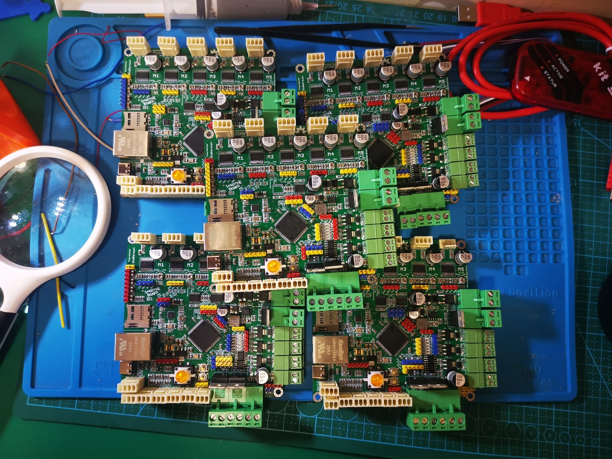

# Smoothieboard-10x10-5driver
Modified according to [Smoothieboard v1.1 5driver](https://www.reprap.org/wiki/Smoothieboard), a more compact and cost-effective design.

## 版本

- 2020-10-13 - 首次开源的版本
- 2020-10-21 - 加宽A5984 OUT引脚的线宽，调整对比见[此处](https://github.com/oldgerman/Smoothieboard-10x10-5driver/blob/master/2020-10-21/image/A5984-changed.png)，1013的钢网文件缺失已补上，但推荐打1021版本
- 2020-12-10 - 优化DCDC电感布线，元件相比2020-10-21未做移动，[布线参考](https://www.monolithicpower.com/en/support/videos/emc-optimized-buck-converter-layout.html)

## Pinout & Pin capabilities

官方抽不出人手绘制fritzing风格的pinout，我根据[Smoothieboard v1.1的pinout](http://smoothieware.org/pinout)乾坤大挪移，建议与原版对比着看

<table>
    <td><image src = 2020-10-21_版本/image/Smoothie-10x10-pinout-map-mini.png></td>
    <td><image src = 2020-10-21_版本/image/Smoothie-10x10-pin-capabilities-mini.png></td>
</table>

## 详细指南

见根目录的：冰沙主板10x10制作笔记.pdf（约30MB）

## 如果...那么不建议使用冰沙

相信各位大侠因为想做贴片机才自远方来，除非你想做基于openpnp的贴片机才建议使用冰沙（32细分最高可能是稳定贴0402阻容，0201就不好说了），但如果你想做3D打印机，相比现在TMC2208步进驱动器基本成为3D打印机的标配（1.4A/36V 256细分 参考价7￥），冰沙的A5984步进驱动器（2.0A/40V 32细分 深水价4￥，但是2A电流香啊）显得过时，因此若冰沙固件的无需编译即可配置的功能对你做机器的帮助不大，或你预算充足，对256细分以及静音有要求，那么不建议使用冰沙主板diy 3D打印机。可以选购常见的基于STM32F407的五轴主板配TMC2208（细分更高且更静音但电流较小），若你想驱动更大电流的例如57步进，或对delta 3D机型的精度有刚需，那么十分推荐diy或购买成品的Duet2 wifi（使用5路TMC2660步进驱动器 4.0A/30V 256细分，深水价13）。

## 为什么要将冰沙主板缩小为10x10？

由于10x10的四层板打样的价格越来越低，而大于10x10的四层板价格仍居高不下，相信不少尝试制作原版冰沙板的大侠一开始就被昂贵的打样费用劝退，因此设计出10x10的冰沙板很有意义，但冰沙主板作为开源了4年以上的开源硬件，其他大佬也设计过不少衍生版本，这些就包括：C3D Remix Board、SKR V-1.3、Cohesion3D Mini、Tiny Smoothie等，尽管替代形状的数量越来越多，但是**原始设计**（[Smoohieboard v1.1）能为中小型CNC机器（包括但不限于3D打印机，激光切割机和CNC铣床）供电和控制所需的所有电子零件：步进电机驱动器（5通道），加热器/冷却器驱动器（6通道Mosfet PWM），温度传感器（4通道），限位开关，SPI，I2C和用于硬件扩展的其他I / O，其中包括USB，UART，以太网和SD卡。替代设计也应包括这些元素或它们的类似物，或说明如何轻松添加它们。（实际上衍生的设计或多或少在板载资源方面都打了折扣）

目前衍生的设计与冰沙板的**相似性**并不太好，对初次接触衍生的主板、阅读原版的文档来学习如何使用冰沙板的朋友们不太友好，因为你需要知道衍生版相比原版的区别（引脚图变动、电子元件变动、布局变动等），因此本id(oldgerman)不另起炉灶，索性直接修改原版的Eagle工程，保留了官方原版（Smoohieboard v1.1）所有的元件和引出的连接器，并适度优化，设计出了Smoothieboard v1.3（10x10），做到原版极其相似的同时，缩小的代价是大功率MOS的载流需要从原来的12.5A降低至11A(20温升)。

## Gerber文件

- 外形尺寸：10x10cm
- 层压顺序：GTL G1 G2 GBL
- 最小孔径：0.3mm
- 最小线宽：6mil
- USB-C：槽孔背面Gerber文件是阻焊，厂家审核可能问开不开窗，两种都行看个人

## Pictures

### 2020-10-13 版本之前的三周目

<table>
    <td><image src = 2020-10-13_版本/image/三周目成品(1).jpg></td>
    <td><image src = 2020-10-13_版本/image/三周目成品(2).jpg></td>
    <td><image src = 2020-10-13_版本/image/三周目测试.png></td>
</table>

### 2020-10-21版本

[红豆](https://oshwhub.com/red_bean)和烂尾侠制作的2020-10-21成品，基本功能测试OK

### 2020-12-10版本

其实我把二周目板上的元件搬了个家。。。

<table>
    <td><image src = 2020-12-10_版本/image/2020-12-10版冰沙_成品tp_small.JPG></td>
    <td><image src = 2020-12-10_版本/image/2020-12-10版冰沙_成品bk_small.JPG></td>
</table>

## 开源硬件(OSHW)

冰沙主板10x10 是开源硬件

<table><td></td></table>
## Acknowledgments

+ The Smoothieboard creators and the [Smoothieware](http://smoothieware.org/) team
+ [JP小可爱小路路](https://space.bilibili.com/479375532?from=search&seid=14974028502933777239)

## 附

基于冰沙主板v1.1的openpnp系统框图

